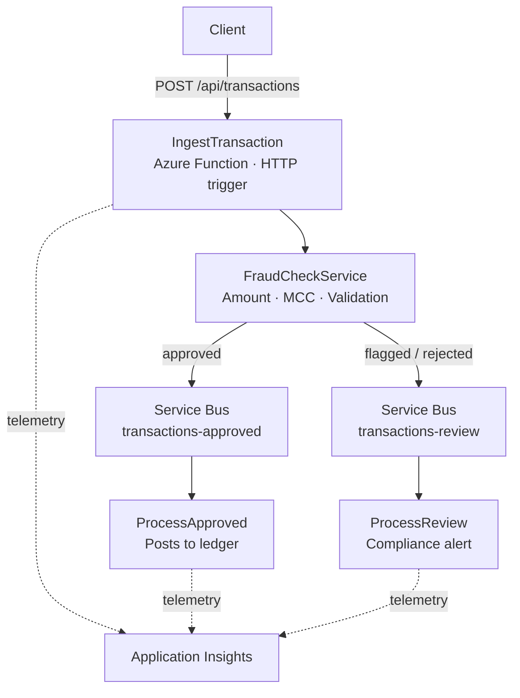

# Financial Integration Hub

A working demonstration of Azure Integration Services applied to financial transaction processing.

## Architecture



## Tech Stack

- **Runtime**: Azure Functions v4, .NET 9 isolated worker
- **Language**: C#
- **Messaging**: Azure Service Bus
- **Observability**: Application Insights
- **IaC**: Bicep
- **CI/CD**: GitHub Actions (build · test · deploy on push to main)
- **Tests**: xUnit (9/9 passing)

## Running Locally

### Prerequisites
- [.NET 9 SDK](https://dotnet.microsoft.com/download)
- [Azure Functions Core Tools v4](https://learn.microsoft.com/azure/azure-functions/functions-run-local)

### Start the API

```bash
cd src/TransactionApi
dotnet build
cd bin/Debug/net9.0
func start
```

### Test the API

```bash
# Approved transaction
curl -s -X POST http://localhost:7071/api/transactions \
  -H "Content-Type: application/json" \
  -d '{"id":"txn-001","accountId":"acc-123","amount":250.00,"merchantName":"Coffee Shop","merchantCategoryCode":"5812","timestamp":"2026-05-27T01:00:00Z"}'

# Flagged - high value
curl -s -X POST http://localhost:7071/api/transactions \
  -H "Content-Type: application/json" \
  -d '{"id":"txn-002","accountId":"acc-456","amount":15000.00,"merchantName":"Unknown","merchantCategoryCode":"5812","timestamp":"2026-05-27T01:00:00Z"}'

# Flagged - high-risk merchant
curl -s -X POST http://localhost:7071/api/transactions \
  -H "Content-Type: application/json" \
  -d '{"id":"txn-003","accountId":"acc-789","amount":50.00,"merchantName":"Shady Merchant","merchantCategoryCode":"7995","timestamp":"2026-05-27T01:00:00Z"}'
```

### Run Tests

```bash
dotnet test tests/TransactionApi.Tests
```

## Fraud Detection Rules

| Rule | Condition | Result |
|------|-----------|--------|
| High value | Amount > $10,000 | Flagged |
| High-risk MCC | 7995, 5933, 6051 | Flagged |
| Invalid amount | Amount ≤ 0 | Rejected |
| Clean transaction | None of the above | Approved |

## Project Structure
```text
├── src/
│   └── TransactionApi/
│       ├── Functions/
│       │   ├── IngestTransaction.cs   # HTTP trigger
│       │   └── ProcessTransaction.cs  # Service Bus consumers
│       ├── Models/
│       │   └── Transaction.cs
│       └── Services/
│           ├── FraudCheckService.cs
│           └── ServiceBusRouter.cs
├── tests/
│   └── TransactionApi.Tests/
│       └── FraudCheckServiceTests.cs  # 9/9 passing
├── infra/
│   └── main.bicep                     # Azure infrastructure
└── .github/
└── workflows/
└── deploy.yml                 # CI/CD pipeline


```

## Live Endpoint

Deployed to Azure Functions (Australia East) with Application Insights telemetry and Service Bus routing.

